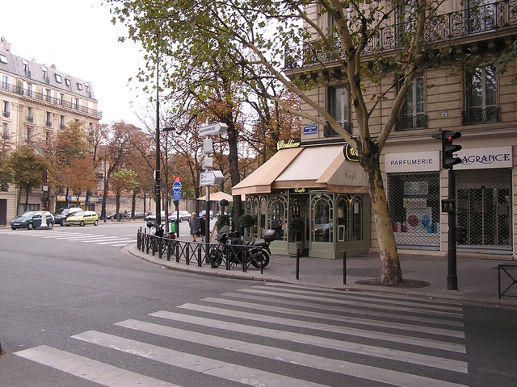

# Project 1 - Image prediction
**Due date**: Oct 4 2016, **6:00am**

## Overview

This project focuses on image level prediciton using deep (convolutional) networks. In this project you will train a network to predict a single label from an image. You have two choices for datasets: Age prediction from yearbook photos or geolocation prediction from streetview images.

## Datasets

### Face to age

*link to follow*

This dataset contains frontal-facing American high school year-book photos with labels to indicate the years those photos were taken. You task is to train a deep network to predict this year on novel images, yearbook images.

*Dataset credit Shiry Ginosar*

### Geolocation

*link to follow*

This dataset contains images from France street view with geolocation label (latitude and longitude). You task is to predict the geolocation of novel street view images.

*Dataset credit Carl Doersch*

## Starter code and data

*Link to github branch to follow*

For both project, we provide you train data set, validation data set (you can use it as your test set). However, we will keep a hidden test set to make sure your algorithm is not overfitting too much.

We also provide you with a python script named `run.py` which defines the interface we will use to evaluate your code on the test set. You can modify `run.py` to run your own model (including loading and running your own model). See the comment in script to know how we will test your code. Make sure your `run.py` works with the evaluation code we provide without any modifications to the evaluation code. Otherwise we will not be able to evaluate your code and you might not get the full credit.

The starter code also contains scripts to load the images and labels for your convenience.

## Deliverables

 1. A **writeup**. Preferably in latex using the CVPR 2016 [stylesheet](http://cvpr2016.thecvf.com/files/cvpr2016AuthorKit.zip). Your writeup should contain:
   * An **intro and abstract** outlining the method you chose and why it's better than alternatives
   * A **technical section**, with a detailed overview of your method and any extensions
   *  A **thorough evaluation** of any aspects of your method. Try to justify every choice you made either with a sound argument, plus citation or with an experiment.
 2. The **code and parameters** to run your model. This code should be written in python. Contact the TA if not.

### How to submit

Please submit a pdf of your writeup and your code in a single compressed file named as `[UTEID]_[You name]_[age/geo].[zip/rar/tar.gz]` (e.g. `hz4674_HuihuangZheng_age.tar.gz`)
The `age` and `geo` mean which project you choose. If you decide to try both please submit two files.
The compressed files should include:
 1. **modified `run.py`** you can add anything, just to make sure the TA can get predicted label by calling predict(image_path) in class Predictor.
 2. A **report** named `report.pdf`, as detailed above.
 3. **Any dependencies** you used that the `run.py` (e.g. trained model file, other auxiliary python files)

Additional notes:

 * Keep the submission **under 2GB**. Otherwise, email the TA.
   * Do not include any image files in your submission
 * Please make sure that in average **each prediction takes less than 200ms** on a nvidia K40 or equivalent GPU. Try to not load the model over and over again (load it just once). Do not train your model on the TAs machine.
   * The program will be terminated if it exceeds the timing limits
 * Test your program before submission to make sure the run.py works. Also make sure that there are **no absolute path** names or relative path names to files that are not submitted.

## Grading

This project counts 30% towards your final grade. The 30 points are split up as follows:

 * **10pt** basics
   * **5pt** writeup
     * Intro
     * Technical section
     * Basic evaluation
   * **5pt** twice chance performance
     * Evaluated by absolute distance between prediction and ground truth.
 * **10pt** extensions (any of these will give you 10pt, if executed successfully). Extension ideas include, but are not limited to
   * **Visualizing** the important regions in the image used by the network
   * **Comparison** of different losses (more than two), such as regression or classification
   * **Benchmarking** different model architectures
   * Training your **own model architecture** from scratch. You need to justify (theoretically or experimentally) why it might work better than standard architectures.
   * **Your own idea.** Double check with the instructor or TA if you're uncertain if it's worth **10pt**.
 * **5pt** running both geolocation and face2year (optional)
 * **3pt** best two submissions on test set (optional)
   * Either geolocation or face2year
 * **10pt** presentation

If you get more than 20pt we truncate the project 1 score at 30% (including presentation).
 
### Late submission policy
The presentation cannot be late, you will loose **10pt** if you do not have a presentation ready.
You will lose **2pt** for every day the submission is late. You will also not be eligible for the *best submission* score.